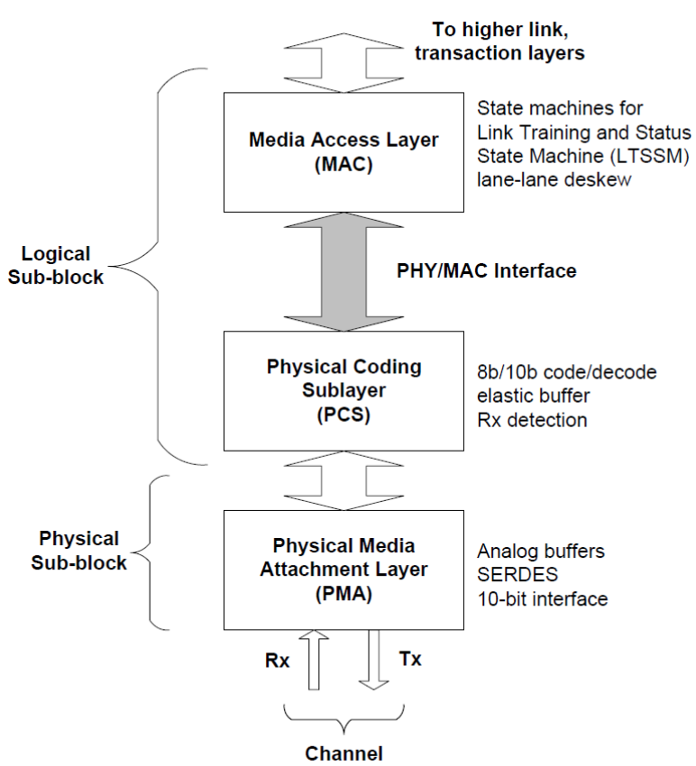
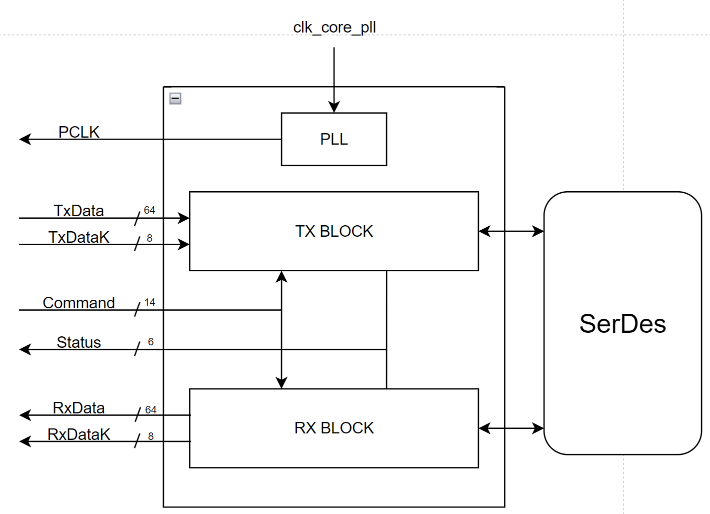
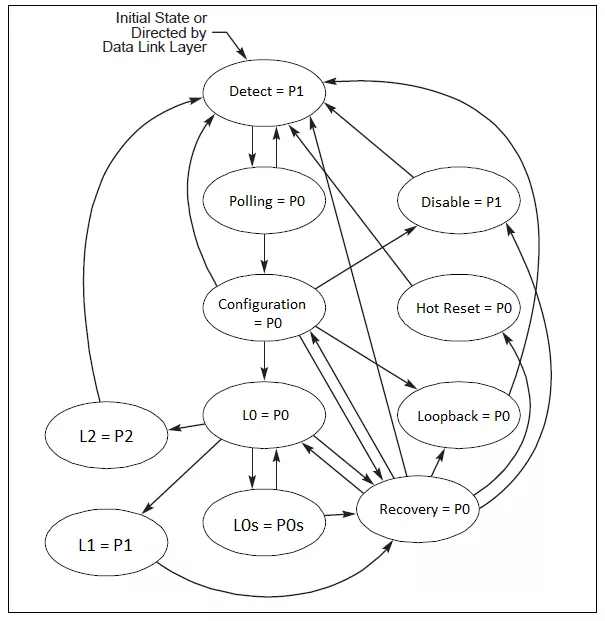

# gatemate-pipe

## Description
The **PHY Interface for the PCI Express Architecture (PIPE)** is part of the physical layer and serves as an interface between the Media Access Layer (MAC) and the Physical Coding Sublayer (PCS). The PIPE interface provides a clear separation between the soft-core RTL development and the FPGA-specific SerDes implementation. This abstraction reduces development effort and enhances portability, making it easier to migrate RTL designs across different FPGA vendors and platforms.

## The Interface
The schematic below illustrates the configuration for the **64-Bit datapath** case. In this configuration, the `o_PCLK` output operates at the same frequency as the **SERDES TX_clock**. For smaller datapath widths, however,`o_PCLK` runs at a frequency that is a multiple of the **TX_clock** frequency, depending on the datapath ratio. For example, in a **32-Bit datapath**, which is half the width of the **64-Bit SERDES datapath**, the `o_PCLK` frequency is twice that of the **TX_clock**. This is done to assure the synchronization between MAC and PHY layer.

- `clk_core_pll`: Reference clock generated by ADPLL of the SerDes.
- `PCLK`: Parallel Interface clock to synchronize MAC and PHY layer.
- `TxData[63:0]`: Transmitted Data.
- `TxDataK[7:0]`: Control flags of transmitted symbols. Each bit represents whether the symbol at that position is a control symbol.
- `RxData[63:0]`: Received Data.
- `RxDataK[7:0]`: Control flags of received symbols. Each bit represents whether the symbol at that position is a control symbol.
- Command:
    - `i_Reset`: Asynchronous Reset for SerDes.
    - `i_PowerDown[1:0]`: Power states. **00 = P0, 01 = P0s, 10 = P1, 11 = P2**.
    - `i_TxElecIdle`: Set the SerDes in Electrical Idle state.
    - `i_TxDetectRx`: Trigger the Receiver Detection operation of the SerDes (P1) or Enable Loopback (P0).
    - `i_TxCompliance[7:0]`: Compliance pattern flags. Each bit represents whether the symbol at that position is a compliance pattern and disparity needs to be set to negative.
    - `i_RxPolarity`: Invert the polarity of the received data if set.
- Status:
    - `o_PhyStatus`: Indicate successful Power State change or finished Receiver Detection.
    - `o_RxElecIdle`: Detection of Electrical Idle on receiving lines.
    - `o_RxValid`: Indicates symbol lock and the received data is valid.
    - `o_RxStatus[2:0]`: Status of the receiver (Description in Table below).

| RxStatus        | Description           |
| --------------- |:---------------------|
| 000             | Received Data OK (P0),  Receiver not detected (P1)         |
| 001             | SKP added              |
| 010             | SKP removed              |
| 011             | Receiver detected (P1)              |
| 100             | 8b/10b Error and optionally  Disparity Error              |
| 101             | Elastic Buffer Overflow              |
| 110             | Elastic Buffer Underflow              |
| 111             | Disparity Error. Unused if  reported together with  8b/10b Error (100)              |

## Power states in PIPE Interface and their relation to power states in LTSSM
Currently, the PIPE interface supports only two power states: **P0** and **P1**. The **P0** state corresponds to normal operation on the transmission line, while the **P1** state represents the PHY’s powered-off mode. The relationship between these PIPE power states and the LTSSM states is illustrated in the diagram below.

## Prerequisites 
The simulation can be run using the [Gatemate open source toolchain](https://colognechip.com/programmable-logic/gatemate/toolchain/).

`source oss-cad-suite/environment` to activate the virtual environment.

## Run Testbench
Run `make testcase` to run the testbench (Note that the testbench currently only works for **64-Bit datapath**).

The testbench also requires the simulation model of the SERDES, which currently can not be disclosed to the public.

## Testbench description
The testbench begins by performing several key state transitions within the PIPE finite state machine (FSM). After initialization, it triggers the word alignment process and proceeds to transmit data. The transmission lines are modeled in the testbench using four registers `RX_SERIO_N`, `RX_SERIO_P`, `TX_SERIO_N`, and `TX_SERIO_P`, which also allow for manual fault injection to simulate various error detection processes.

## References
- [PIPE Specs, Sept. 2025, v7.1](https://cdrdv2-public.intel.com/643108/643108_PIPE_Arch_Spec_Rev_7_1.pdf)
- [Philipp Ledüc's Masterthesis](https://opus.bsz-bw.de/fhdo/frontdoor/index/index/year/2021/docId/3076)
- [Optimizing PCIe PIPE Interface Power Management](https://www.synopsys.com/blogs/chip-design/optimizing-pcie-pipe-power-management.html)
